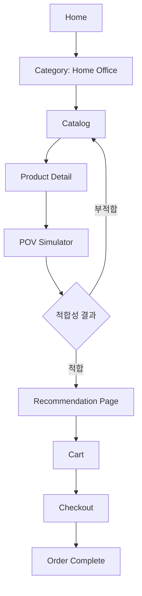

# POVIEW UI Flow

## 배경
- [ ] POVIEW의 MVP는 `홈 오피스(Desk-terior)` 카테고리에서 구매 전 판단 정확도를 높이는 것이 목적이다.
- [ ] 사용자는 "예쁘다"보다 "내 키/공간/예산에 맞는가"를 빠르게 확인해야 한다.

## 목표
- [ ] 홈 화면 진입부터 구매 결정까지의 흐름을 단일 여정으로 단순화한다.
- [ ] 핵심 판단 포인트(키 기반 POV, 공간 적합성, 예산 추천)가 중간에 끊기지 않도록 설계한다.
- [ ] 사용자가 3분 이내에 1개 세트 후보를 확정하도록 UX를 설계한다.

## 범위
- [ ] 플랫폼: 반응형 웹(모바일 우선, 데스크톱 확장)
- [ ] 도메인: 홈 오피스(책상/의자/수납)
- [ ] MVP 화면: 홈 -> 카테고리/탐색 -> 제품 상세 -> POV 시뮬레이션 -> 추천 비교 -> 장바구니/구매

## 작업 단계
- [ ] 1) 화면 목록 확정
- [ ] `Home`, `Catalog`, `ProductDetail`, `POVSimulator`, `RecommendationPage`, `Cart`, `Checkout`, `MyProfile`
- [ ] 경로 매핑: `RecommendationPage`는 `/recommendations` 경로를 사용한다.
- [ ] 2) 상태 전이 정의
- [ ] 프로필(키/예산/공간치수)은 전 화면 공통 상태로 유지하고, 시뮬레이션 결과를 추천 화면으로 전달한다.
- [ ] 3) 핵심 CTA 통일
- [ ] 상세에서 `POV로 확인하기`, 시뮬레이션에서 `추천 세트 보기`, 추천에서 `이 구성으로 구매`로 고정한다.
- [ ] 4) 예외 흐름 정의
- [ ] 에셋 로딩 실패, 저사양 성능 저하, 프로필 미입력 시 대체 경로를 제공한다.

## 리스크
- [ ] 화면 수가 늘어나면 핵심 가치(POV 판단)보다 탐색 UI가 복잡해질 수 있다.
- [ ] 시뮬레이션 진입 이전에 이탈하면 차별화 기능 체험이 어렵다.
- [ ] 프로필 입력 마찰이 크면 초기 이탈률이 높아질 수 있다.

## 검증 계획
- [ ] 사용성 리허설에서 "홈 -> 후보 1개 확정"까지 걸린 시간을 측정한다.
- [ ] 5명 테스트 기준 주요 경로 완료율 80% 이상, 중도 이탈 지점 2개 이하를 목표로 한다.
- [ ] 예외 흐름(로딩 실패/프로필 미입력)에서도 구매 경로 복귀율 70% 이상을 목표로 한다.

## 상세 화면 흐름

## 화면별 핵심 액션
- [ ] `Home`: 서비스 가치와 시작 CTA(`내 POV 설정`)
- [ ] `Catalog`: 필터(예산/사이즈/스타일)와 빠른 비교
- [ ] `ProductDetail`: 스펙 + `POV로 확인하기`
- [ ] `POVSimulator`: 키 반영 시점, 여유 공간 수치, 적합/주의 배지
- [ ] `RecommendationPage`: 예산 구간별 세트 3안 비교
- [ ] `Cart/Checkout`: 선택한 세트 유지, 총액/옵션 확인
